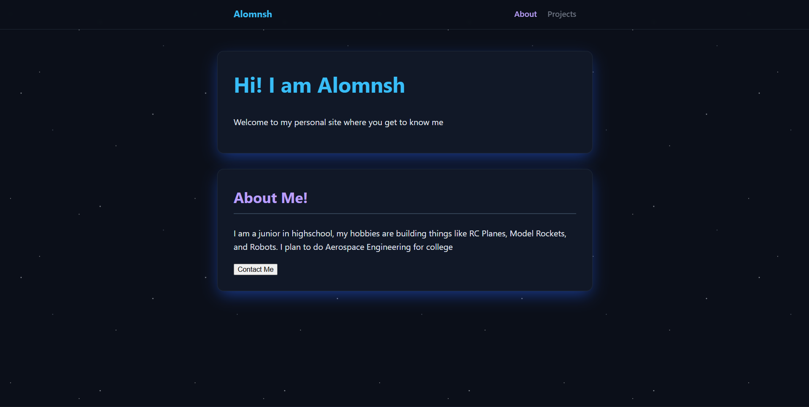

# My Personal Site
My personal website and portfolio, it uses `html` for the structure and `css` for styling!!
## Website Features
* A navigation bar on top of the page that has a subtle liquid glass effect just like Apple's
* An introduction and about me section
* Contact Me page
* A subpage for my projects
* Underglow on sections
* Hover effects on links and project cards
* Star background
## Credits
* Credit to the Hack Club Personal Site workshop to help me get started!

